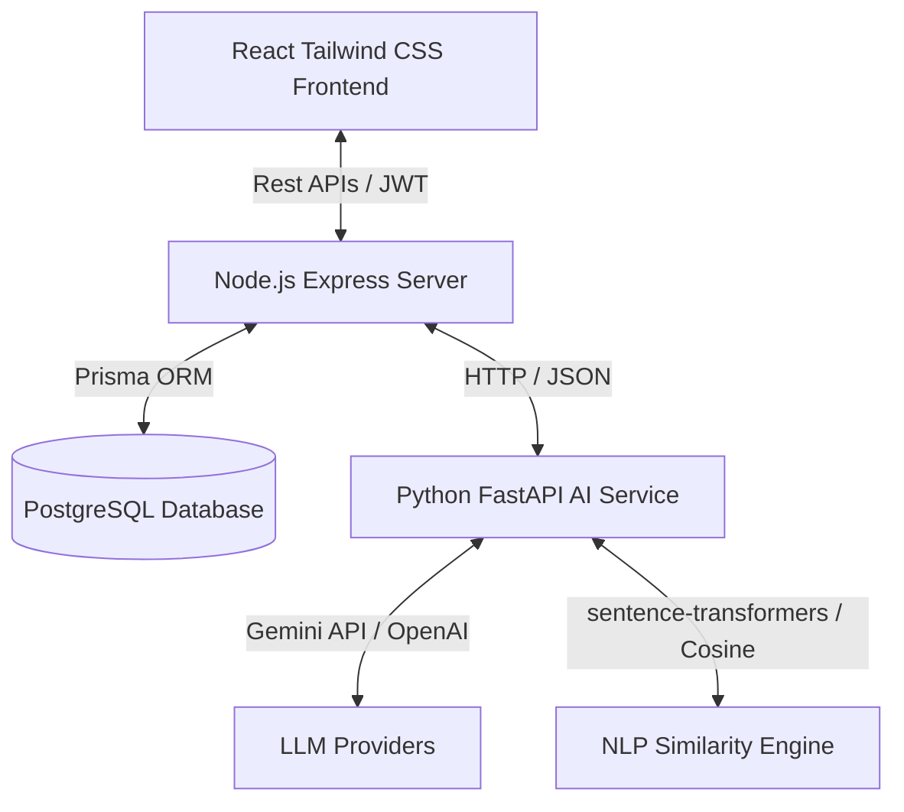

# InterviewMind AI – AI Interview Evaluation Engine

**InterviewMind AI** is an advanced, production-grade technical interview evaluation engine. It leverages Generative AI (Gemini / OpenAI) and Natural Language Processing (NLP) to dynamically assess candidate answers, measure semantic similarity, detect skill gaps, and probe deeper using project-based cross-questioning.

This monorepo contains a Node.js Express API gateway, a Python FastAPI AI microservice, and a sleek, minimal React candidate dashboard.

---

## 🌟 Why This Project is Unique
1. **Dynamic Project Cross-Questioning**: Unlike standard QA systems, if a candidate answers a project-related question, the engine analyzes their tech stack, description, and weaknesses, then dynamically injects 2–3 follow-up drill questions directly into their active interview wizard.
2. **Dual-Layer NLP Evaluation**: Combines high-level LLM feedback with local text-embedding calculations (`sentence-transformers` or TF-IDF fallback) to measure cosine similarity against reference answer models.
3. **Structured Pydantic Contract**: The Python FastAPI service validates all incoming prompts using rigid Pydantic models to guarantee JSON outputs, with retries and graceful mock fallbacks if the LLM provider fails.
4. **Weighted Score Engine**: Computes a comprehensive weighted grade for each answer and compile final reports detailing strengths, weaknesses, missing skills, and a personalized 30-day preparation roadmap.

---

## ⚙️ Monorepo Architecture



### Flow Breakdown
1. **Setup**: The candidate selects a target role (e.g. Backend Developer), difficulty, experience, and submits their project description and stack.
2. **Generation**: The Express backend hits `/ai/generate-questions`. FastAPI queries the Gemini API to generate 4 distinct questions (Technical, Project, Scenario, HR).
3. **Submissions**: The candidate answers each question. The Express backend posts candidate answers to FastAPI to compute similarity scores and evaluate technical correctness, clarity, completeness, and confidence.
4. **Cross-Examination**: If the question type is `PROJECT`, the evaluator calls `/ai/generate-cross-questions` and appends follow-up questions to the active session.
5. **Report & PDF**: After completion, the backend compiles final recommendations, writes a structured roadmap, and streams a custom-designed PDF report via `pdfkit`.

---

## 🗄️ Database Schema & Models

Prisma ORM manages the schema in the `database/schema.prisma` file. Below is the table outline:

* **User**: Manages developer/recruiter records, password hashing (bcrypt), and roles (`CANDIDATE` or `ADMIN`).
* **Interview**: Stores session config, progress state, and aggregated scoring metrics.
* **Question**: Holds question text, type (TECHNICAL, PROJECT, SCENARIO, HR), and the ideal answer model.
* **Answer**: Records candidate text, metrics (Accuracy, Clarity, Completeness, Confidence, Similarity), strengths, weaknesses, and improved guides.
* **CrossQuestion**: Maps generated follow-up questions back to their parent questions for audit.
* **Report**: Contains compiled roadmap plans, missing skills, final recommendations, and PDF routes.

---

## 🚀 Setup & Execution Guide

### Prerequisite Versions
* Node.js v20+
* Python 3.10+
* PostgreSQL database instance running locally or hosted (or SQLite fallback)

---

### Step 1: Clone and Configure Environment Files

1. Copy env templates to actual `.env` files:
   ```bash
   cp backend/.env.example backend/.env
   cp ai-service/.env.example ai-service/.env
   cp frontend/.env.example frontend/.env
   ```

2. Add your credentials to the newly created files:
   * **`backend/.env`**:
     * `DATABASE_URL`: Add your PostgreSQL connection URL.
     * `JWT_SECRET`: Add a secure key.
   * **`ai-service/.env`**:
     * `GEMINI_API_KEY`: Input your Google Gemini API token.
     * `OPENAI_API_KEY`: (Optional) Input your OpenAI API token to serve as a fallback.

---

### Step 2: Database Initialization (PostgreSQL & Prisma)

1. Navigate to the backend directory:
   ```bash
   cd backend
   ```
2. Install Node.js dependencies:
   ```bash
   npm install
   ```
3. Run the Prisma migration to sync the PostgreSQL database:
   ```bash
   npm run prisma:migrate
   ```
4. Generate the Prisma client:
   ```bash
   npm run prisma:generate
   ```

---

### Step 3: Python AI Service Setup

1. Navigate to the AI service directory:
   ```bash
   cd ai-service
   ```
2. Create and activate a Python virtual environment:
   ```bash
   # Windows:
   python -m venv .venv
   .venv\Scripts\activate

   # macOS/Linux:
   python3 -m venv .venv
   source .venv/bin/activate
   ```
3. Install Python dependencies:
   ```bash
   pip install -r requirements.txt
   ```
4. Run the FastAPI development server:
   ```bash
   uvicorn main:app --host 0.0.0.0 --port 8000 --reload
   ```

---

### Step 4: React Frontend Setup

1. Navigate to the frontend directory:
   ```bash
   cd frontend
   ```
2. Install dependencies:
   ```bash
   npm install
   ```
3. Run the Vite development server:
   ```bash
   npm run dev
   ```

---

## 🛠️ Optional SQLite Fallback (Local Testing Only)

If you do not have a PostgreSQL database ready for local testing, you can temporarily switch the ORM to SQLite in a few steps:

1. Open `database/schema.prisma` and modify the datasource block:
   ```prisma
   // database/schema.prisma
   datasource db {
     provider = "sqlite"
     url      = "file:./dev.db"
   }
   ```
2. Open `backend/.env` and replace your database URL:
   ```env
   DATABASE_URL="file:../database/dev.db"
   ```
3. Regenerate and apply migrations locally:
   ```bash
   cd backend
   npx prisma db push --schema=../database/schema.prisma
   ```

---

## 📊 Score Calculation Formula

The final answer score utilizes a strict weighted metric system to balance local semantic calculations against generic LLM scoring:

$$\text{Final Score} = (\text{Technical Accuracy} \times 0.35) + (\text{Completeness} \times 0.25) + (\text{Clarity} \times 0.15) + (\text{Semantic Cosine} \times 0.15) + (\text{Confidence} \times 0.10)$$

*Note: The Semantic Cosine score (0.0 to 1.0) is scaled by 10 to match the other 0–10 score bounds.*

---

## 📡 API Routes Reference

### Backend Gateway APIs (`PORT 5000`)
* **Auth**:
  * `POST /api/auth/register` - Create user.
  * `POST /api/auth/login` - Authenticate and sign JWT.
  * `GET /api/auth/me` - Profile context.
* **Interviews**:
  * `POST /api/interviews/create` - Setup details.
  * `GET /api/interviews/my` - Fetch user sessions.
  * `GET /api/interviews/:id` - Session details.
  * `POST /api/interviews/:id/generate-questions` - Generates questions list.
  * `POST /api/interviews/:id/submit-answer` - Grades answer and checks for cross-questions.
  * `POST /api/interviews/:id/final-report` - finalizes and detected skill gaps.
  * `GET /api/interviews/:id/download-report` - Streams pdf file.
* **Admin**:
  * `GET /api/admin/candidates` - Candidate directory.
  * `GET /api/admin/analytics` - Cohort stats averages and distributions.
  * `GET /api/admin/reports` - Fetch all reports.

### FastAPI AI Service (`PORT 8000`)
* `POST /ai/generate-questions` - System prompt template questions list.
* `POST /ai/evaluate-answer` - Grades correctness, strengths, and feedback.
* `POST /ai/semantic-score` - Cosine semantic similarity calculation.
* `POST /ai/generate-cross-questions` - Generates 2-3 project drill-downs.
* `POST /ai/detect-skill-gaps` - Flags missing capabilities.
* `POST /ai/generate-final-report` - Summarizes roadmap steps.

---

## 📄 Resume Bullet Points
Include these bullet points on your resume:
* Built an AI interview evaluation engine using Python FastAPI, GenAI, and NLP to generate role-based interview questions and evaluate candidate answers.
* Developed a semantic scoring system using sentence similarity, weighted evaluation rules, and LLM-based feedback generation.
* Implemented project-based cross-questioning that generates follow-up technical questions from candidate project descriptions and responses.
* Designed secure backend APIs using Node.js, Express.js, JWT authentication, and PostgreSQL for storing interviews, scores, and reports.
* Generated structured interview reports with score breakdown, strengths, weak areas, hiring recommendation, and personalized improvement roadmap.
